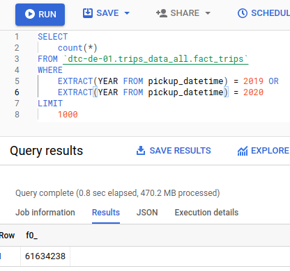
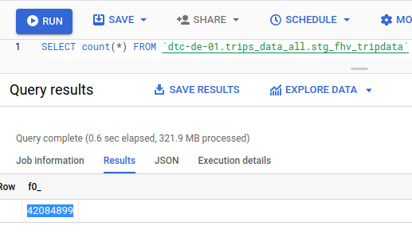
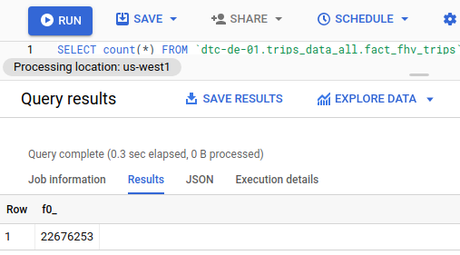

# DEZ Week 4


# Q1


```SQL
SELECT
    count(*)
FROM `dtc-de-01.trips_data_all.fact_trips`
WHERE
    EXTRACT(YEAR FROM pickup_datetime) = 2019 OR
    EXTRACT(YEAR FROM pickup_datetime) = 2020
LIMIT
    1000
```
Solution: 61634238

Option (closest): 61635151

# Q2

[See report here](./Trips_Analysis_2019-20.pdf)


```
89.9/10.1
```

# Q3



Use the following command to run

```
docker-compose run \
  --workdir="//usr/app/dbt/taxi_rides_ny" \
  dbt-de-zoomcamp \
  build  --select +stg_fhv_tripdata --var 'is_test_run: false'
```

Answer: 42084899

# Q4



Use the following command to run

```
docker-compose run \
  --workdir="//usr/app/dbt/taxi_rides_ny" \
  dbt-de-zoomcamp \
  build  --select +fact_fhv_trips --var 'is_test_run: false'
```
Answer: 22676253

```


# Q5

[See report here](./fact_fhv_trips.pdf)

Answer: January